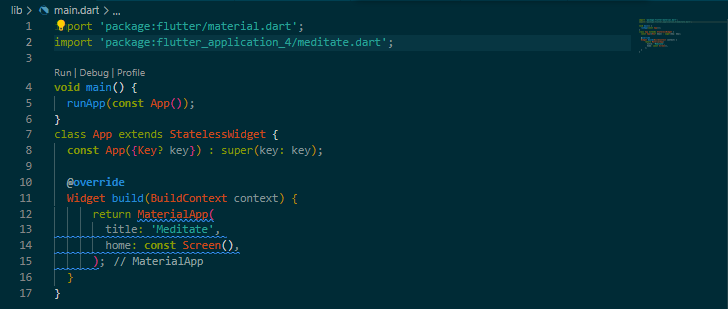
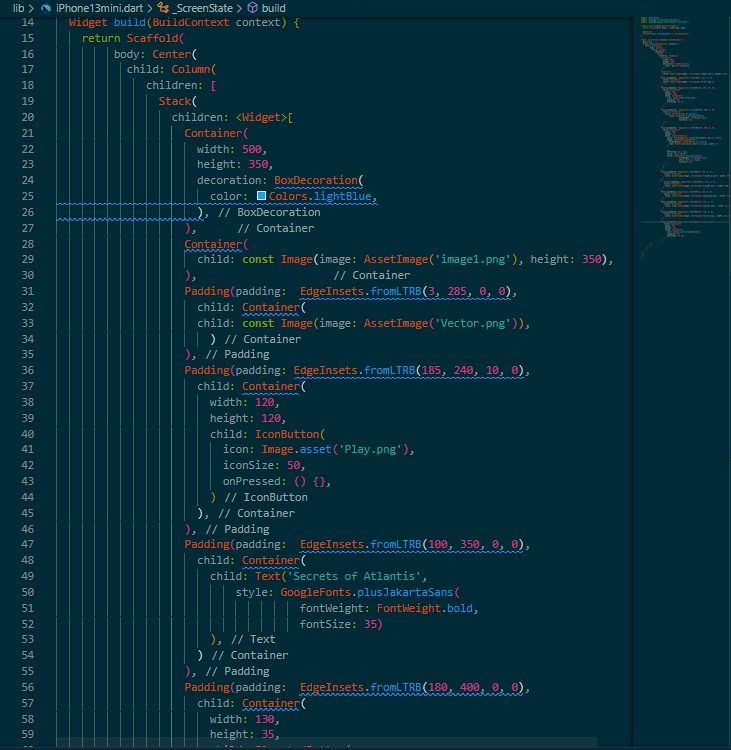

# Практическая работа №1

## Тема: Разработка макета.
#### Цель работы: сделать 3 макета оценка - 5, 2 макета оценка - 4, 1 макет оценка - 3.
#### Ход работы:

#### Первое окно

#### Второе окно

\

#### Вывод: в данной практической работе были разработаны 3 окна по примеру из макета
