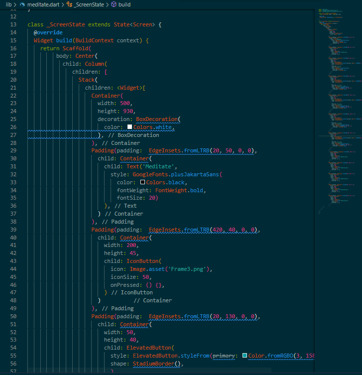
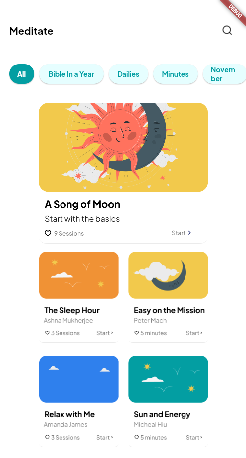

# Практическая работа №1

## Тема: Разработка макета.
#### Цель работы: сделать 3 макета оценка - 5, 2 макета оценка - 4, 1 макет оценка - 3.
#### Ход работы:

#### Код для отображения окон

#### Создание 1-ого окна (Meditate)

#### Создание 2-ого окна (iPhone 13 mini)

#### Вывод: в данной практической работе были разработаны 3 окна по примеру из макета
